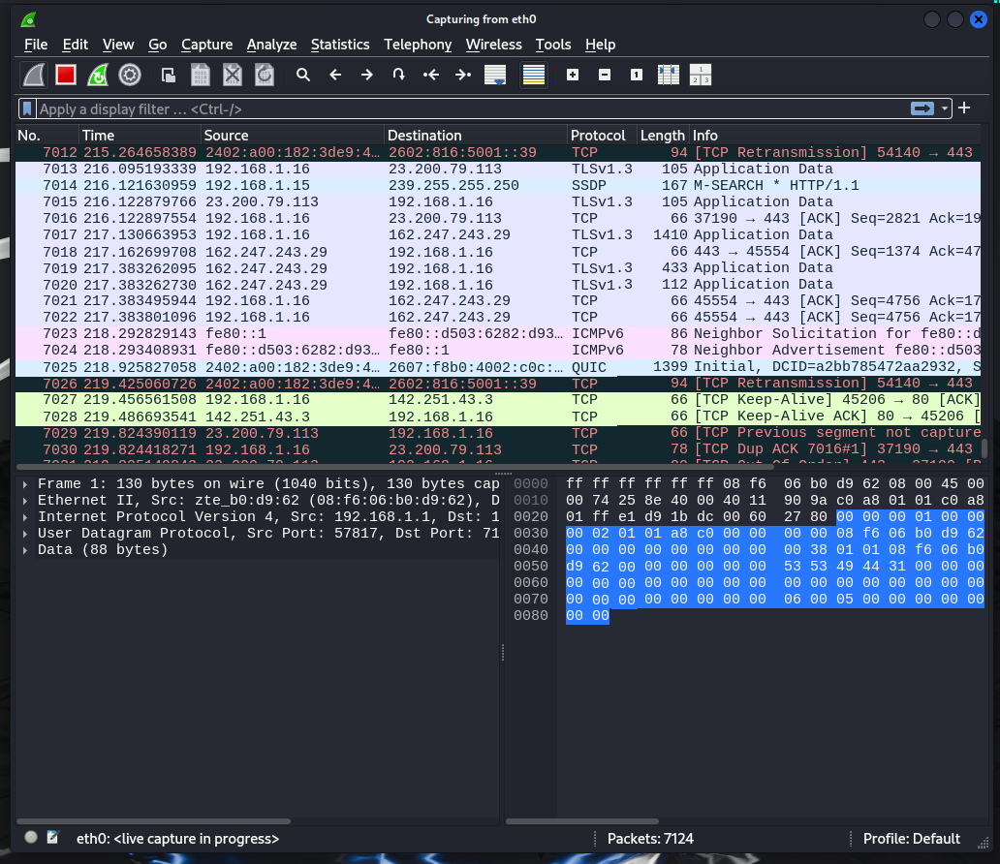
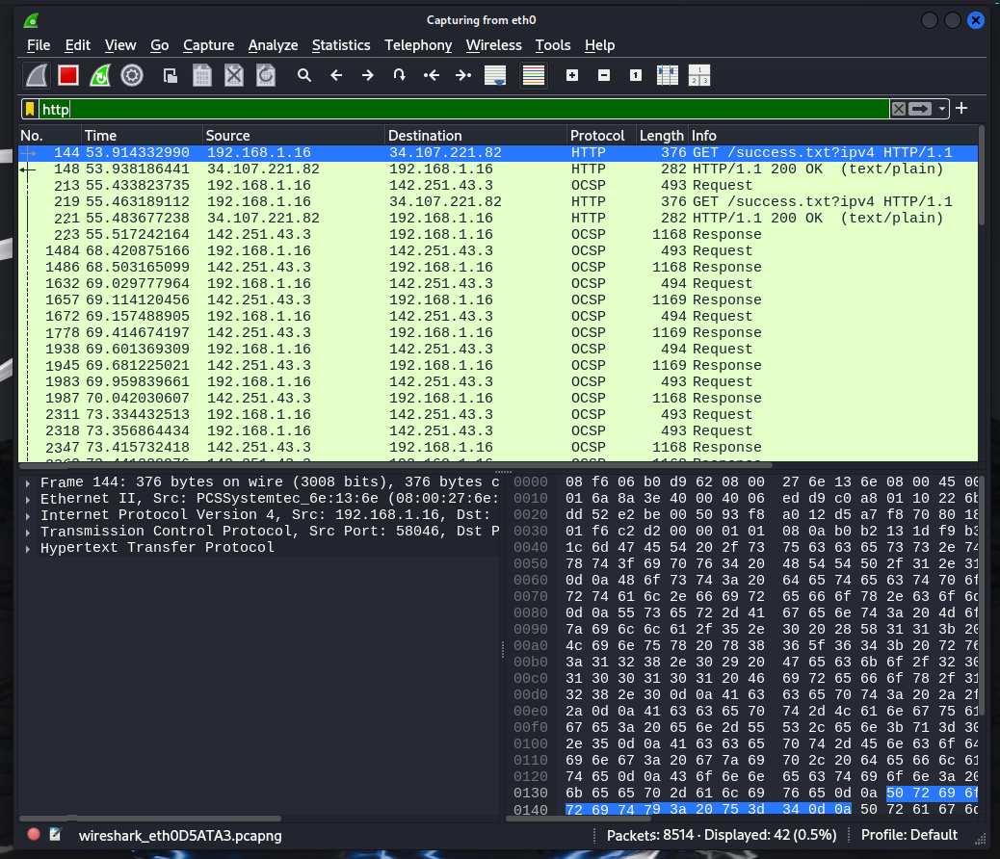
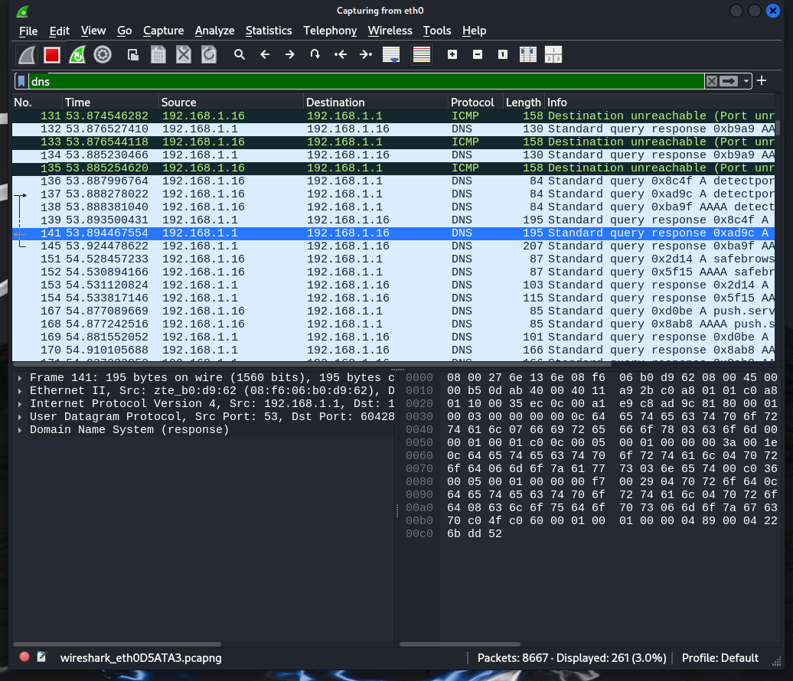
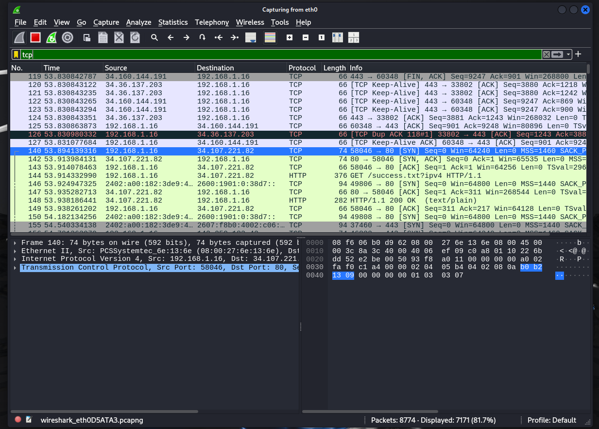
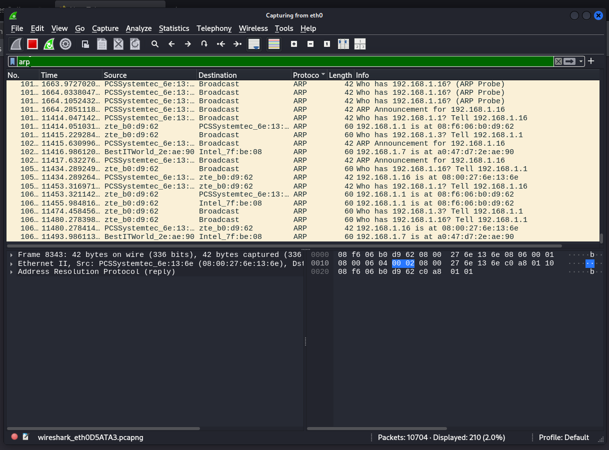
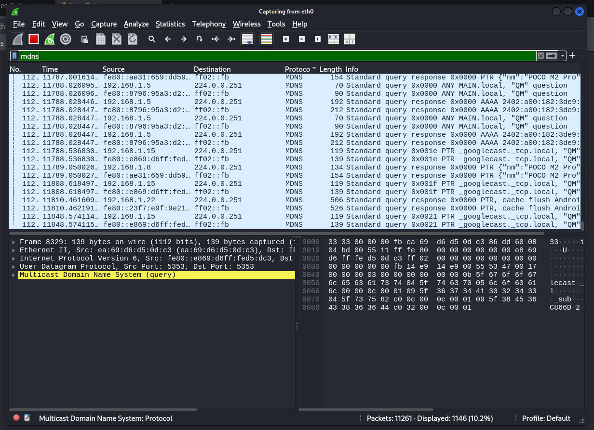
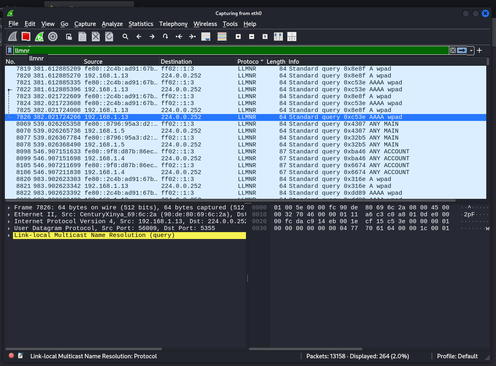
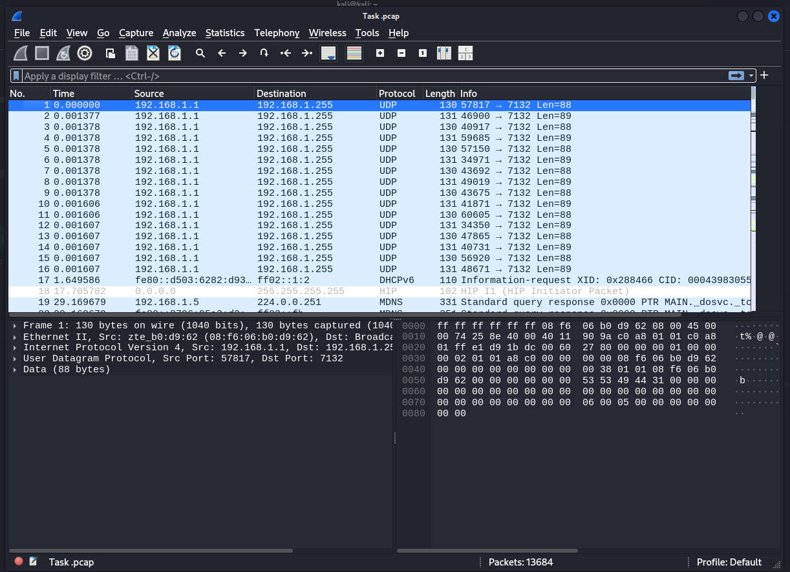

#Task 5: Capture and Analyze Network Traffic Using Wireshark.

Objective: Capture live network packets and identify basic protocols and traffic types.
Tools: Wireshark

1. Started capturing my network traffic/interface

3. Browsed the website flipkart.com and filtered & observed HTTP, DNS, and TCP responses using Wireshark.

4. Also identified and learnt about ARP, MDNS & LLMNR protocol responses

5. Exported the capture as .pcap file

6. Summary During the capture, I identified the following protocols: HTTP, DNS, and TCP.
   HTTP traffic included GET and response packets between my browser and the web server.
   DNS queries resolved domain names to IP addresses, with multiple responses from the DNS server.
   TCP packets showed the three-way handshake and data transmission, with no retransmissions or errors observed. The capture involved traffic between my local IP and the server IPs, primarily using ports 80 (HTTP) and 53 (DNS).         Overall,the traffic appeared normal, with no signs of anomalies or performance issues.
